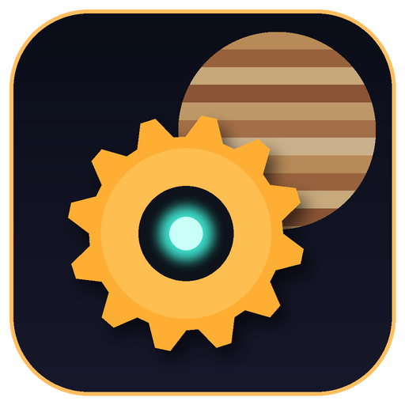

<h1 align="center">AUTOMATON</h1>

<b>Monte uma fábrica automatizada no planeta KX-7, sob o céu de Júpiter, e turbine tudo programando em Jiboia 🐍.</b>

---

## 📥 Instalar

1. Baixe o **`AUTOMATON-Setup-<versão>.exe`** em **[Releases](../../releases/latest)**.
2. Abra o instalador e escolha a pasta (ou deixe a padrão).
3. Jogue pelo atalho **AUTOMATON** na área de trabalho ou no menu Iniciar.

> Na primeira vez, o Windows pode mostrar **"O Windows protegeu o computador"**. Clique em **Mais informações → Executar assim mesmo**.

**Requisitos:** Windows 10 ou 11 (64 bits), placa de vídeo com suporte a WebGL 2 (praticamente qualquer uma dos últimos 10 anos) e 400 MB livres.
**Não precisa de internet** pra jogar. Ela só é usada no **Jogar junto** (multiplayer).

## 🎮 O jogo

- **Planeta procedural** com 5 biomas e 3 lugares pra pousar: Floresta das Serras, Cânion Vermelho e Tundra Gelada. Cada semente gera um mundo diferente.
- **Fábrica estilo Satisfactory:** mineradores, fornalhas, construtoras, montadoras, esteiras Mk1 a Mk5 (monte o caminho inteiro de uma vez), divisores, energia e cabos.
- **Marcos e o Projeto Foguete:** sem loja e sem dinheiro. Tudo sai do que você produz.
- **Programação:** computadores rodando **Jiboia**, uma linguagem em português parecida com Python, que controlam e turbinam as máquinas.
- **Céu vivo:** Júpiter chegando perto, duas luas, eclipses, auroras, chuva de meteoros e flora que brilha à noite.
- **Jogar junto** com um amigo, ligando os PCs direto.

## ⌨️ Controles principais

| Tecla | Ação |
|---|---|
| `W A S D` · `Shift` · `Espaço` | andar · correr · pular |
| `E` (segurar) | coletar / usar máquina |
| `1`–`9` · `B` | barra de construção · menu de construção |
| `Clique` · `R` · `X` | colocar · girar · desmontar |
| `Ctrl+Z` | desfazer |
| `Tab` · `H` | mapa · guia completo |
| `O` | jogar junto |
| `F11` | tela cheia |
| `Esc` | pausa (salvar, configurações, sair) |

O **guia completo** está dentro do jogo: aperte **`H`**.

## 💾 Saves

O jogo salva sozinho a cada 30 segundos e ao fechar. Os saves ficam em `%APPDATA%\AUTOMATON` e **continuam lá** se você atualizar ou reinstalar o jogo.

## 📜 Créditos

Modelos, sons, texturas e fontes de terceiros estão em **[CREDITOS.md](CREDITOS.md)**.

---

Pra montar o instalador a partir deste código: <code>npm install</code> e depois <code>npm run dist</code>. A cada envio na <code>main</code>, o GitHub monta o instalador e publica a Release da versão que está no <code>package.json</code>.
